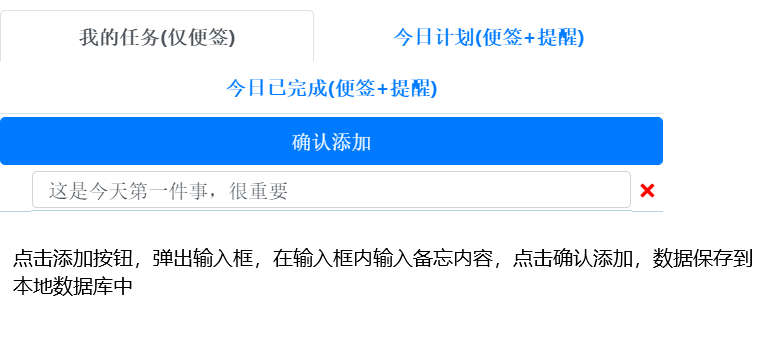
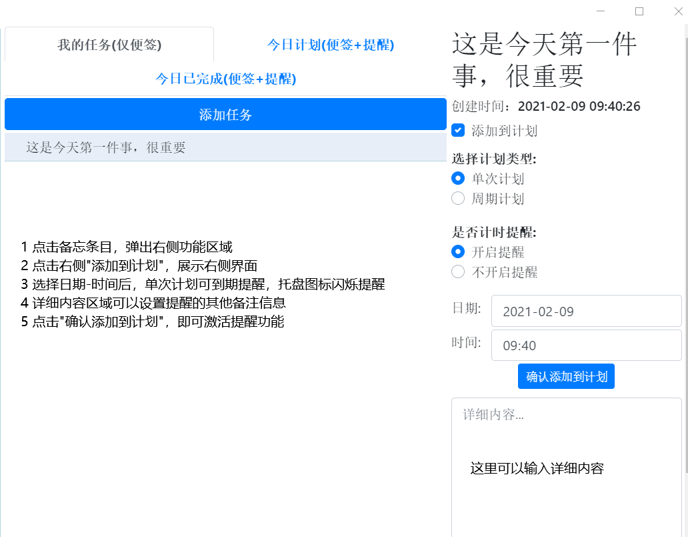
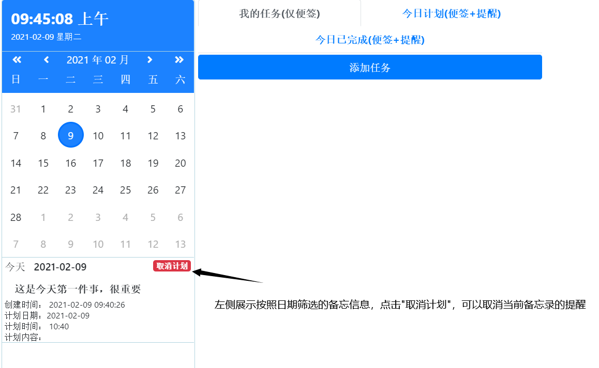

# remind-vue
基于electron-vue编写的提醒工具

#运行
npm install

npm run dev

或执行cnpm相关命令

#打包
cnpm install electron-packager -g

electron-packager .

参考：https://blog.csdn.net/fukaiit/article/details/90964319

#窗口参考链接

https://github.com/zsj975516/electron-window-util

#项目展示

